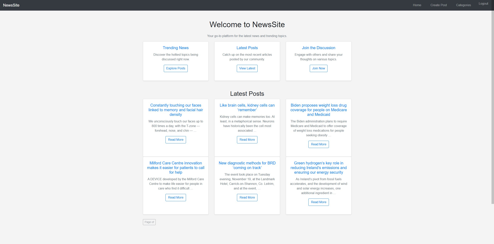
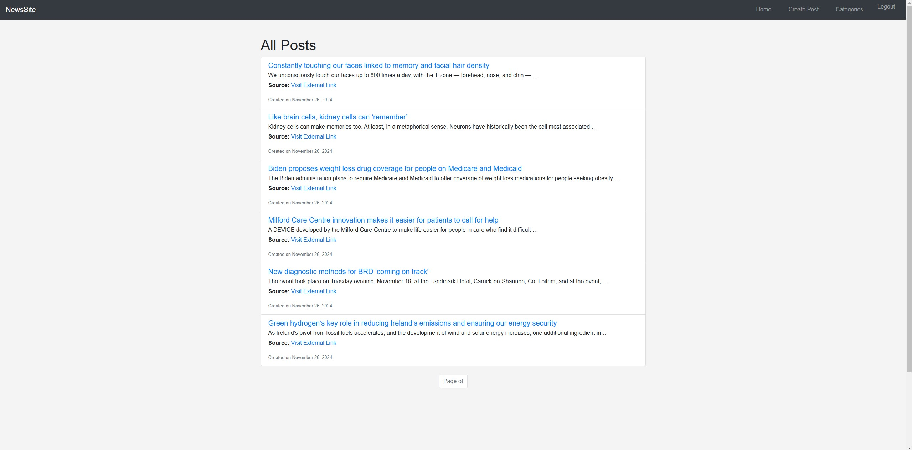
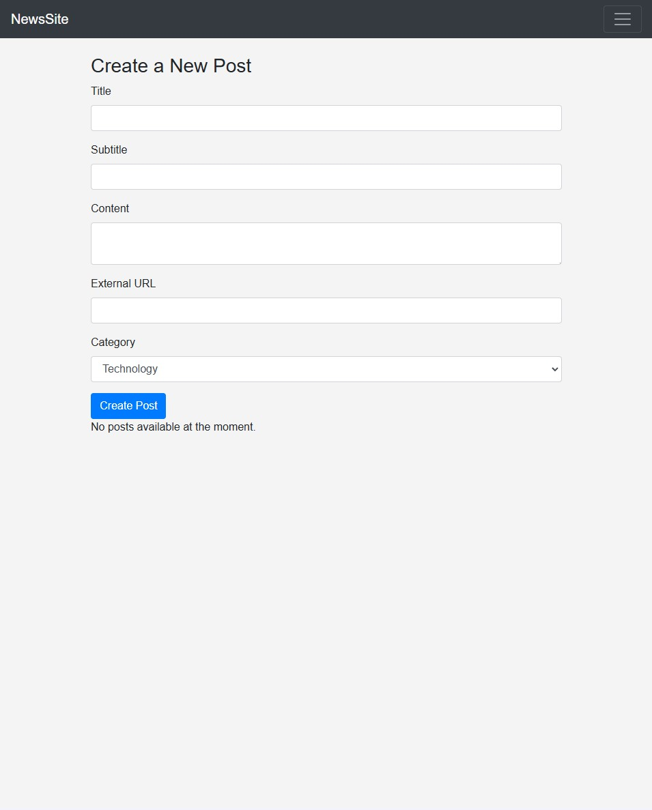
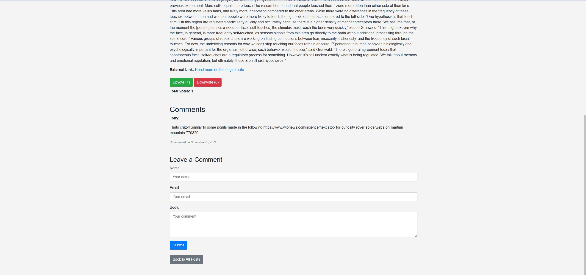
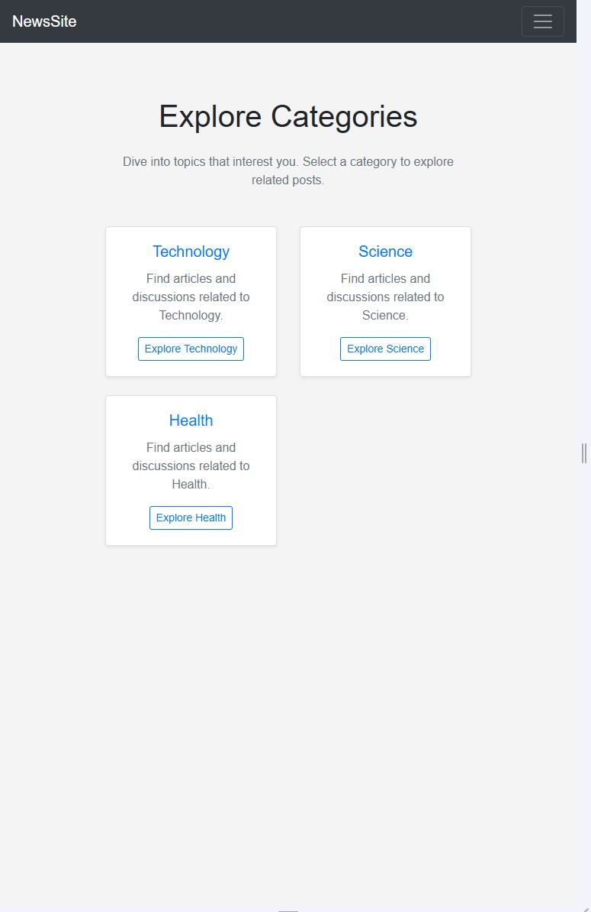
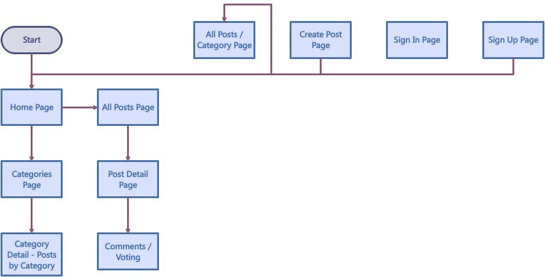

# **NewsSite**

NewsSite is a Reddit-style news aggregation platform where users can browse, create, vote, and comment on posts organized by categories. The platform also supports user profile customization with avatars.

---

## **Table of Contents**
1. [Project Overview](#project-overview)
2. [Main Features](#main-features)
3. [Technologies Used](#technologies-used)
4. [Installation and Setup](#installation-and-setup)
5. [Database Configuration](#database-configuration)
6. [User Profile and Avatar](#user-profile-and-avatar)
7. [Deployment](#deployment)
8. [Project Structure Flowchart](#project-structure-flowchart)
9. [Author](#author)

---

## **Project Overview**

NewsSite is a full-stack web application that offers a seamless way for users to:
- Explore trending posts across multiple categories.
- Engage with posts by upvoting/downvoting or leaving comments.
- Add new posts with optional external source links and featured images.
- View content by category.
- Customize their profile with an avatar during signup.

---

## **Main Features**

- **Categories:** Posts are organized into categories like Health, Science, and Technology.
- **User Authentication:** Includes signup, login, logout, and profile management.
- **Content Interaction:** Users can vote on posts and add comments.
- **Post Creation:** Users can add new posts with a title, content, optional external links, and an image.
- **Responsive Design:** Optimized for mobile and desktop devices.







---

## **Technologies Used**

### **Frontend:**
- **HTML5, CSS3:** Markup and styling for a clean, user-friendly interface.
- **JavaScript:** For interactive features, including voting functionality.

### **Backend:**
- **Python + Django:** Framework for server-side logic and dynamic content rendering.
- **Relational Database:** PostgreSQL for production, SQLite3 for development.

### **Deployment:**
- **Heroku:** For hosting the application.
- **Cloudinary:** For media file storage.

---

## **Installation and Setup**

Follow the steps below to set up the project locally:

### 1. Clone the Repository

```bash
git clone https://github.com/Markmcl25/project-4.1.git
cd project-4.1
```

### 2. Install Dependencies

```bash
pip install -r requirements.txt
```

### 3. Set Up the Database

Use Postgres as the database. You can set up a local Postgres instance or use a managed Postgres database service.

- Update the DATABASE_URL in your .env file with your database credentials:

```bash
DATABASE_URL=postgres://<username>:<password>@<host>:<port>/<dbname>
```

- Run migrations to set up the database schema:

```bash
python manage.py makemigrations
python manage.py migrate
```

### 4. Set Up Cloudinary

This project uses Cloudinary for media storage. Create a Cloudinary account and get your API keys.

- Add the following to your .env file:

```bash
CLOUDINARY_URL=cloudinary://<api_key>:<api_secret>@<cloud_name>
```

### 5. Set Up Heroku

This project is configured to deploy on Heroku.

- Log in to Heroku:

```bash
heroku login
```

- Add Heroku as a remote:

```bash
git remote add heroku https://git.heroku.com/reddit-new.git
```

- Deploy your project:

```bash
git push heroku main
```

- Set the necessary environment variables in Heroku:

```bash
heroku config:set SECRET_KEY=<your_django_secret_key>
heroku config:set CLOUDINARY_URL=cloudinary://<api_key>:<api_secret>@<cloud_name>
heroku config:set DATABASE_URL=<your_database_url>
```

- Run migrations on Heroku:

```bash
heroku run python manage.py migrate
```

### 6. Run the Development Server

- To test locally, run:

```bash
python manage.py runserver
```

---

## **Layout Flowchart**

Below is a visual representation of the project's flow and layout:



---

## **Features in Detail**

User Features

### 1. Register and Login
Users can register with a username, email, password, and avatar. Authentication is managed via Django Allauth.

### 2. Create and Browse Posts
Authenticated users can create posts with a title, content, and optional external URL. Posts can be categorized.

### 3. Upvote and Downvote
Registered users can upvote or downvote posts to prioritize content.

### 4. Comment on Posts
Users can leave comments on individual posts.

## **Admin Features**

### 1. Manage Posts and Categories
The admin can add, edit, or delete posts and categories.

### 2. User Management
Admin can manage user accounts and review submitted posts.

## **Front-End Design**

### 1. Categories Navigation
Categories are accessible via the navbar, leading to a page that lists all posts within the selected category.

### 2. Responsive Design
The application is fully responsive using Bootstrap.

## **Deployed Application**

The application is deployed on Heroku and accessible at:

https://reddit-new-2d2861630b68.herokuapp.com/
